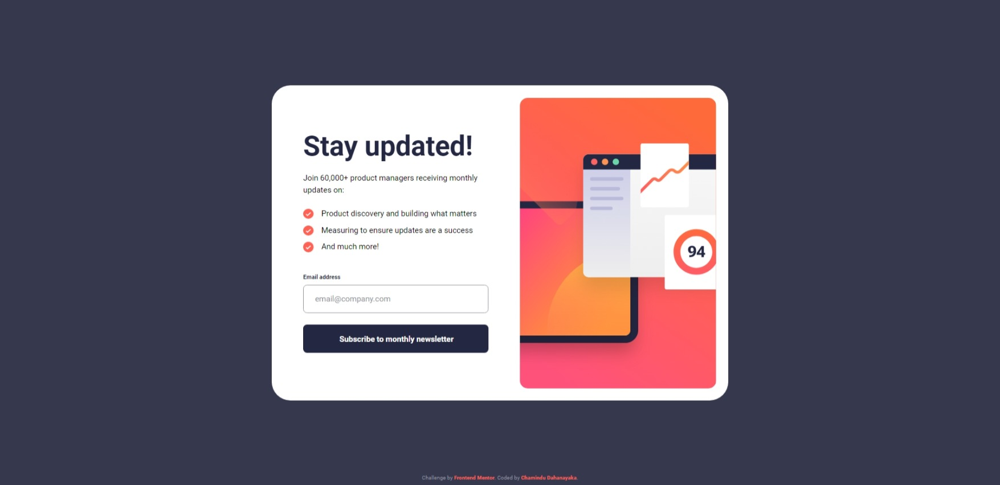

# Frontend Mentor - Newsletter sign-up form with success message solution

This is a solution to the [Newsletter sign-up form with success message challenge on Frontend Mentor](https://www.frontendmentor.io/challenges/newsletter-signup-form-with-success-message-3FC1AZbNrv). Frontend Mentor challenges help you improve your coding skills by building realistic projects. 

## Table of contents

- [Overview](#overview)
  - [The challenge](#the-challenge)
  - [Screenshot](#screenshot)
  - [Links](#links)
- [My process](#my-process)
  - [Built with](#built-with)
  - [What I learned](#what-i-learned)
  - [Continued development](#continued-development)
- [Author](#author)

## Overview

### The challenge

Users should be able to:

- Add their email and submit the form
- See a success message with their email after successfully submitting the form
- See form validation messages if:
  - The field is left empty
  - The email address is not formatted correctly
- View the optimal layout for the interface depending on their device's screen size
- See hover and focus states for all interactive elements on the page

### Screenshot



### Links

- Solution URL: [Solution URL here](https://www.frontendmentor.io/solutions/responsive-newsletter-signup-form-with-success-message-using-react-js-Ne_q5g6Hp3)
- Live Site URL: [Live site URL here](https://chamindud.github.io/Newsletter-sign-up-form-with-success-message/)

## My process

### Built with

- Semantic HTML5 markup
- Flexbox
- Mobile-first workflow
- [React](https://reactjs.org/) - JS library

### What I learned

In this project, I learned to use below code snippets:

```jsx
function handleChange(event){
    setInputEmail(event.target.value);

    if(event.target.value.length == 0){
        setError('Email cannot be empty');
        setBgColor('hsla(4, 100%, 67%, 0.15)');
        setBorderColor('hsl(4, 100%, 67%)');
        return false;
    }
    if(!event.target.value.match(/^[a-zA-Z0-9._%+-]+@[a-zA-Z0-9.-]+\.[a-zA-Z]{2,}$/)){
        setColor('hsl(4, 100%, 67%)');
        setError('Valid email required');
        setBgColor('hsla(4, 100%, 67%, 0.15)');
        setBorderColor('hsl(4, 100%, 67%)');
        return false;
    }else{
        setColor('black');
        setError('');
        setBgColor('transparent');
        setBorderColor('hsl(231, 7%, 60%)');
        return true;
    }
        
}

function handleSubmit(){
    const event = { target: { value: inputEmail } };
    const isValid = handleChange(event);
    if(isValid){
        setButtonType('submit');
        setSubmitSuccess(true);
        onSubmit(inputEmail);
    }
}
```

### Continued development

I'm looking to improve my CSS & JavaScript knowledge to design more unique and new stuff.

## Author

- Frontend Mentor - [@ChaminduD](https://www.frontendmentor.io/profile/ChaminduD)
- LinkedIn - [Chamindu Dahanayaka](https://www.linkedin.com/in/chamindudahanayaka/)